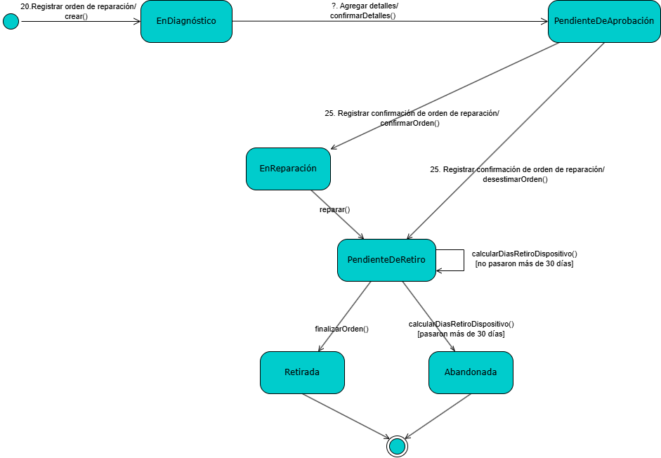

# ReparApp: Sistema de Gestión de Reparaciones de Dispositivos Electrónicos

## Caso de Estudio Funcional y Arquitectura de Software
Proyecto desarrollado bajo el marco de trabajo ágil Scrum para la gestión operativa y administrativa de servicios técnicos integrales.

---

## Análisis del Problema de Negocio y Solución Propuesta

* **Contexto:** Establecimiento comercial de servicio técnico con flujos operativos descentralizados, falta de trazabilidad en los estados de reparación y deficiencias en el control de stock de repuestos.
* **Objetivo del Sistema:** Procesar y centralizar la información desde la recepción del dispositivo, diagnóstico, presupuesto y control de asignación de técnicos, hasta la entrega final y facturación al cliente.

---

## Matriz de Roles y Alcance Funcional

El sistema valida las restricciones lógicas y de privacidad mediante un control de acceso basado en roles (RBAC) para cuatro perfiles independientes:

| Rol | Responsabilidades Funcionales Clave |
| :--- | :--- |
| **Asistente de Ventas** | Recepción de equipos, alta de clientes y dispositivos, generación de órdenes de reparación en estado inicial, entrega y cobro. |
| **Técnico** | Diagnóstico técnico, asignación de repuestos a la orden, registro de avances de reparación y actualización de estados logísticos. |
| **Asistente de Compras** | Gestión de proveedores, control de puntos de reposición y actualización de existencias de repuestos críticos. |
| **Supervisor** | Administración de usuarios del sistema, auditoría de logs y generación de reportes estratégicos en formatos CSV y PDF. |

---

## Ingeniería de Procesos: Máquina de Estados de una Orden

El diseño funcional garantiza que una Orden de Reparación evolucione de forma consistente, impidiendo transiciones lógicas inválidas en la persistencia de datos.



### Flujos Críticos de Transición:
1. **Presupuestada a En Reparación:** Requiere la confirmación explícita del cliente.
2. **En Reparación a Pendiente de Retiro:** El técnico debe registrar obligatoriamente el resultado (Reparado / No Reparado) y los repuestos consumidos.
3. **Pendiente de Retiro a Abandonada:** Automatización lógica si el cliente excede los 30 días de corrido para retirar el dispositivo.

---

## Arquitectura y Modelo de Dominio

Para dar soporte a las reglas de negocio descritas, se diseñó un modelo relacional normalizado. El diagrama estructurado de entidades y sus relaciones se detalla a continuación:


* **Componentes Técnicos:** El backend está desarrollado en Python (Flask) con persistencia en SQLite. Implementa el manejo de sesiones seguras para restringir las peticiones HTTP según el perfil del usuario autenticado.

---

## Gestión de Proyecto y Metodología

El desarrollo se estructuró en cuatro Sprints bajo el marco de trabajo Scrum, priorizando el Product Backlog según el valor de negocio de las épicas definidas:

* **Sprint 0:** Relevamiento de requerimientos, análisis de riesgos y diseño preliminar de arquitectura (DER y diagramas UML).
* **Sprint 1 y 2:** Implementación del núcleo transaccional (Módulo de Órdenes de Reparación y control de estados).
* **Sprint 3 y 4:** Configuración de seguridad (RBAC), módulo de compras y desarrollo de componentes para la exportación de reportes.

---

## Repositorio de Documentación Técnica

Para consultar la especificación detallada de la ingeniería del proyecto, los documentos originales se encuentran disponibles en la carpeta `/docs`:

* [Manual de Usuario del Sistema](./docs/ReparApp%20-%20Manual%20de%20Usuario.pdf): Guía detallada paso a paso de las interfaces y de la gestión operativa de una orden para cada perfil de acceso.
* [Plan de Proyecto y Requerimientos](./docs/ReparApp%20-%20Plan%20de%20Proyecto%20.pdf): Definición formal de objetivos, alcances del producto, requerimientos funcionales y requerimientos no funcionales.
* [Definición del Producto e Ingeniería Técnica](./docs/ReparApp%20-%20Definición%20del%20producto.pdf): Product Backlog completo, diseño detallado de Épicas, Historias de Usuario con Criterios de Aceptación y Casos de Prueba.

---

## Instrucciones de Instalación y Despliegue Local

Requisitos
- Python 3.11+ instalado (requerido mínimo: 3.11).

Comprobar la versión de Python
- En una terminal (cmd.exe) ejecuta:

```cmd
python -V
```

Debería devolver algo como `Python 3.13.9` o `Python 3.11.x`. Si la versión es menor a 3.11 actualiza tu instalación o usa un intérprete compatible.

Pasos (Windows - cmd.exe):

1. Abrir una terminal en la carpeta `Backend`:

```cmd
cd /d c:\Users\Leo\Desktop\RepararApp\ReparApp\Backend
```

2. Crear y activar un entorno virtual (recomendado):

```cmd
python -m venv .venv
.venv\Scripts\activate
```

3. Instalar dependencias:

```cmd
pip install -r requirements.txt
```

4. Arrancar la aplicación:

```cmd
python app.py
```

Notas
- Si tienes varias versiones de Python, usa la ruta absoluta al ejecutable (por ejemplo `C:\Users\Leo\AppData\Local\Microsoft\WindowsApps\python3.13.exe`) para asegurarte de instalar y ejecutar con el mismo intérprete.
- Si `ModuleNotFoundError` aparece al ejecutar `python app.py`, muy probablemente estés usando un intérprete distinto al que instalaste las dependencias. Revisa `where python` en cmd.exe o `Get-Command python` en PowerShell.

Ejecutar usando `run_backend.bat`
Si prefieres un único comando que cree/active el entorno, instale dependencias y arranque el backend, usa `run_backend.bat` desde la raíz del repositorio.

Desde cmd.exe (raíz del repo):
```cmd
cd /d c:\Users\Leo\Desktop\RepararApp\ReparApp
run_backend.bat
```

Forzar un intérprete concreto (opcional):
```cmd
set PY_EXE=C:\Users\Leo\AppData\Local\Microsoft\WindowsApps\python3.13.exe
run_backend.bat
```

Actualizar pip antes de instalar (opcional):
```cmd
set UPGRADE_PIP=1
run_backend.bat
```

Desde PowerShell:
```powershell
Set-Location -Path 'c:\Users\Leo\Desktop\RepararApp\ReparApp'
$env:PY_EXE='C:\Users\Leo\AppData\Local\Microsoft\WindowsApps\python3.13.exe' # opcional
.\run_backend.bat
```

Contacto
- Añade instrucciones adicionales o solicita ayuda si necesitas que pruebe la app en esta sesión.

Ejecutar el frontend usando `run_frontend.bat`
Si quieres arrancar el frontend (Vite + React) con un solo comando, uso el script `run_frontend.bat` que instala dependencias y arranca el servidor de desarrollo.

Desde cmd.exe (raíz del repo):
```cmd
cd /d c:\Users\Leo\Desktop\RepararApp\ReparApp
run_frontend.bat
```

Forzar un ejecutable de Node (opcional):
```cmd
set NODE_EXE=C:\path\to\node.exe
run_frontend.bat
```

Desde PowerShell:
```powershell
Set-Location -Path 'c:\Users\Leo\Desktop\RepararApp\ReparApp'
$env:NODE_EXE='C:\path\to\node.exe' # opcional
.\run_frontend.bat
```

URL de desarrollo
- Por defecto Vite suele levantar el servidor en http://localhost:5173 – cuando arranques `run_frontend.bat` mira la salida para confirmar el puerto exacto.

Notas
- Si prefieres usar `pnpm` o `yarn`, dime y adapto el script para detectarlos/soportarlos.

Detalles avanzados del `run_frontend.bat`
- El script ahora detecta automáticamente `pnpm`, `yarn` o `npm` en PATH y usa el primero disponible. Si prefieres forzar uno, exporta `PKG_MGR` antes de ejecutar:

```cmd
set PKG_MGR=pnpm
run_frontend.bat
```

- Para evitar que el navegador se abra automáticamente (por ejemplo en CI), ejecuta con `OPEN_BROWSER=0`:

```cmd
set OPEN_BROWSER=0
run_frontend.bat
```

- El script pasa el flag `--open` al comando de dev para abrir el navegador automáticamente (si no se desactiva con `OPEN_BROWSER=0`).

Mejora pendiente: abrir el dev server en una nueva ventana
- Actualmente `run_frontend.bat` arranca el servidor en la misma terminal. Una mejora posible es lanzar el dev server en una nueva ventana de terminal (por ejemplo usando `start` en Windows) para que la terminal actual quede libre. Implementarlo implicaría:
	1) construir el comando completo que ejecuta el gestor de paquetes y los flags (por ejemplo `pnpm run dev -- --open`).
	2) usar `start "Vite" cmd /k "<comando>"` para abrir una nueva ventana y dejarla ejecutando.
	3) manejar la salida/CI (no abrir ventanas en entornos sin interfaz).
- Si quieres que lo implemente ahora, lo adapto para que use `start` con detección de entorno (interactivo vs CI).
Implementación: `START_NEW_WINDOW` y detección CI
- El script ya soporta lanzar el dev server en una nueva ventana usando `start "Vite" cmd /k "<comando>"`. Por defecto esto está activado en entornos interactivos.
- Si la variable de entorno `CI` está definida (entornos de integración continua) el script no abrirá nuevas ventanas.
- Para forzar el comportamiento localmente, puedes:

```cmd
set START_NEW_WINDOW=1  # forzar nueva ventana
run_frontend.bat

set START_NEW_WINDOW=0  # forzar ejecución en la ventana actual
run_frontend.bat
```
